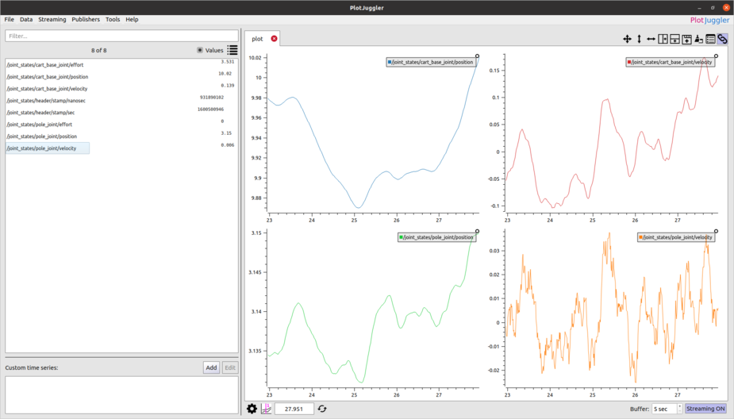

## Pendulum demo tutorial

### Launch 

The best way to run the pendulum demo is using ros2 launch. To check all the available launch
 options use the following command:

```shell script
$ ros2 launch -s pendulum_bringup pendulum_bringup.launch.py 
Arguments (pass arguments as '<name>:=<value>'):

    'autostart':
        Automatically start lifecycle nodes
        (default: 'True')

    'priority':
        Set process priority
        (default: '0')

    'cpu-affinity':
        Set process CPU affinity
        (default: '0')

    'lock-memory':
        Lock the process memory
        (default: 'False')

    'lock-memory-size':
        Set lock memory size in MB
        (default: '0')

    'config-child-threads':
        Configure process child threads (typically DDS threads)
        (default: 'False')

    'driver-enable':
        Enable/disable pendulum driver)
        (default: 'True')

    'controller-enable':
        Enable/disable pendulum controller)
        (default: 'True')

    'rviz':
        Launch RVIZ2 in addition to other nodes
        (default: 'False')
```

Another way to run the demo is to use `ros2 run`. To see all the options use `-h`:

```shell script
$ ros2 run pendulum_demo pendulum_demo -h
[INFO] [1600508474.177191293] [process_settings]: 	[--autostart auto start nodes]
	[--lock-memory lock memory]
	[--lock-memory-size lock a fixed memory size in MB]
	[--priority set process real-time priority]
	[--cpu-affinity set process cpu affinity]
	[--config-child-threads configure process settings in child threads]
	[--driver-enable enable/disable pendulum driver]
	[--controller-enable enable/disable pendulum controller]
	[-h]
```

The demo requires to pass the ros2 parameters. This can be done by using `--ros-args`:

```shell
$ ros2 run pendulum_demo pendulum_demo --autostart True --ros-args --params-file src/pendulum/pendulum_bringup/params/pendulum.param.yaml
```

Note, the demo doesn't not include for the moment any log message, see the following sections to
 check how to introspect the running demo. 

### Modify the parameters

The method used to configure the node specific options is by using 
[ros2 parameters](https://index.ros.org/doc/ros2/Tutorials/Parameters/Understanding-ROS2-Parameters/). 
The parameters yaml file is located in `src/pendulum/pendulum_bringup/params/pendulum.param.yaml
`, by default it contains the following parameters.

```yaml
pendulum_controller:
  ros__parameters:
    state_topic_name: "joint_states"
    command_topic_name: "joint_command"
    teleop_topic_name: "teleop"
    command_publish_period_us: 10000
    enable_topic_stats: False
    topic_stats_topic_name: "controller_stats"
    topic_stats_publish_period_ms: 1000
    deadline_duration_ms: 0
    controller:
      feedback_matrix: [-10.0000, -51.5393, 356.8637, 154.4146]

pendulum_driver:
  ros__parameters:
    state_topic_name: "joint_states"
    command_topic_name: "joint_command"
    disturbance_topic_name: "disturbance"
    cart_base_joint_name: "cart_base_joint"
    pole_joint_name: "pole_joint"
    state_publish_period_us: 10000
    enable_topic_stats: False
    topic_stats_topic_name: "driver_stats"
    topic_stats_publish_period_ms: 1000
    deadline_duration_ms: 0
    driver:
      pendulum_mass: 1.0
      cart_mass: 5.0
      pendulum_length: 2.0
      damping_coefficient: 20.0
      gravity: -9.8
      max_cart_force: 1000.0
      noise_level: 1.0
```


### Use ros2 command line interface tools (ros2cli)

The easiest way to instrospect the demo is by using the 
[ros2 command line interface tools](Introspection with command line tools). 

In terminal 1:

```shell script
$ ros2 launch pendulum_bringup pendulum_bringup.launch.py
```

In terminal 2, check all the available topic:

```shell script
$ ros2 topic list
/controller_stats
/disturbance
/driver_stats
/joint_command
/joint_states
/parameter_events
/pendulum_controller/transition_event
/pendulum_driver/transition_event
/rosout
/teleop
```

In terminal 2, echo the pendulum joint states topic:

```shell script
$ ros2 topic echo /joint_states
header:
  stamp:
    sec: 1600509693
    nanosec: 527079661
  frame_id: ''
name:
- cart_base_joint
- pole_joint
position:
- -0.05765941272694896
- 3.1385413009557075
velocity:
- 0.09066771810749848
- 0.0036469760911343823
effort:
- 4.3474129360921765
- 0.0
---
header:
```
The cart position should be close to 0.0 and the pole angle should be close to PI, that is, the
 pole up position. 

### Visualize the pendulum in rviz

To visualize the pendulum in rviz launch the demo with the rviz option enabled:

```shell script
ros2 launch pendulum_bringup pendulum_bringup.launch.py rviz:=True
```

This command will open an rviz window showing a model of the pendulum.


### Move the pendulum

The pendulum can be controller by using the topic `/teleop`.

```text
# PendulumTeleop.msg
# This represents the desired state of the pendulum for teleoperation
float64 pole_angle
float64 pole_velocity
float64 cart_position
float64 cart_velocity
```

By sending a teleoperation message it is possible to control the cart position. For the moment
 only the cart commands are accepted. For example, using `ros2 pub` to move the cart to a
  position 5.0, we would send a command as follows: 

```shell script
ros2 topic pub -1 /teleop pendulum2_msgs/msg/PendulumTeleop "cart_position: 5.0"
```

### Display time series plots using PlotJuggler

Another way to instrospect the inverted pendulum status is using 
[PlotJuggler](https://github.com/facontidavide/PlotJuggler). This assumes that PlotJuggler is
 installed and the demo is already running. 
 


### Use lifecycle node functionality

The controller and the drivers nodes are 
[managed lifecycle nodes](http://design.ros2.org/articles/node_lifecycle.html). 
That means that it is possible to control the state of the nodes by using the ros2 lifecycle
 functionalities. In the demo, the option `autostart` was added to simplify things and
  automatically transit the nodes to the active state if this option is enabled. 
  
Let's see an example of how manually transitioning the nodes to the active state. 

Check the node names:
  
```shell script
$ ros2 node list
  /pendulum_controller
  /pendulum_driver
```

Use `ros2 lifecycle` to get and change the node states:
```shell script
$ ros2 lifecycle get /pendulum_controller
unconfigured [1]
$ ros2 lifecycle set /pendulum_controller configure
Transitioning successful
$ ros2 lifecycle set /pendulum_driver configure
Transitioning successful
$ ros2 lifecycle set /pendulum_controller activate
Transitioning successful
$ ros2 lifecycle set /pendulum_driver configure
Transitioning successful
```

- TODO(carlossvg): add cleanup instructions
